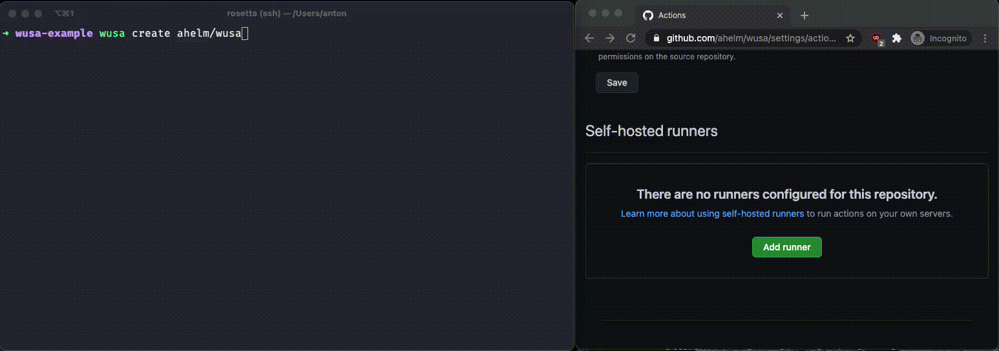

# Wusa

> Isis (Ancient Egyptian: ꜣst; Coptic: Ⲏⲥⲉ Ēse; Classical Greek: Ἶσις Isis; Meroitic: 𐦥𐦣𐦯‎ Wos[a] or <span style="text-decoration: underline;">Wusa</span>) was a major goddess in ancient Egyptian religion whose worship spread throughout the Greco-Roman world.
>
> Source: [Wikipedia](https://en.wikipedia.org/wiki/Isis)



Wusa is also a command-line tool to help manage _containerized self-hosted GitHub
Action Runner_. In some rare cases, you might require special hardware to execute
your CI/CD pipeline. For these cases, `wusa` helps you remove the burden of setting up a docker container on your local machine, connecting it to your GitHub repositories, and provides simple commands.

> **WARNING** wusa is in the early stages, and issues might appear. Please try it out and let me know what you think of wusa.

## Installation

If you wish to install wusa, use pip

```shell
pip install wusa
```

or use [pipx](https://github.com/pipxproject/pipx)

```shell
pipx install wusa
```

## Usage

Wusa uses, at the moment, a ubuntu image with the GitHub Action runners. Wusa requires permission to be able to create runners for you. For this, run the following command and follow the steps:

```shell
wusa auth
```

Afterward, you can create a containerized docker runner for a repo by running

```shell
wusa create "ahelm/wusa"
```

With `"ahelm/wusa"`is the short name of the repository.

If you wish to list all the runner for a repository, run

```shell
wusa list-repo "ahelm/wusa"
```

or if you wish to remove a runner

```shell
wusa remove <some_runner_name>
```
